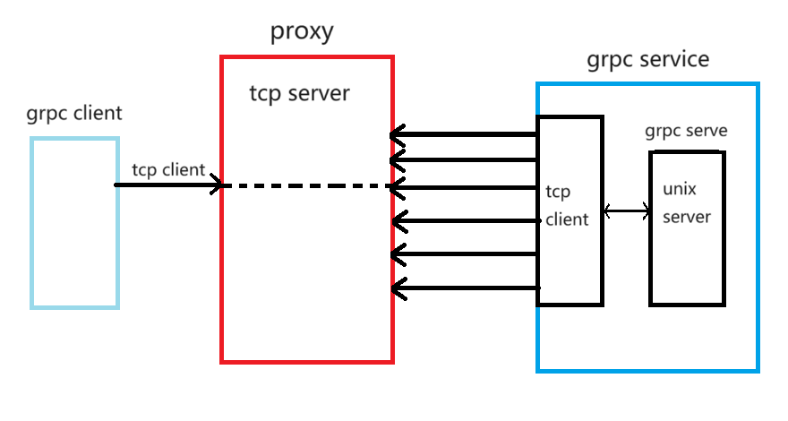

## 简单的原理图


## proxy server
1. 创建 tcp listener, 用于grpc client 和 grpc service 通信
```go
func Run() error {
	// 创建 CA证书 用于 tls 连接
	ca, err := private_keys.NewCA("127.0.0.1")
	if err != nil {
		log.Fatal(err)
	}
	serverCA, err := tls.X509KeyPair(ca.CertPem(), ca.KeyPem())
	if err != nil {
		log.Fatal(err)
	}

	tlsServerConfig := &tls.Config{
		Certificates: []tls.Certificate{serverCA},
	}
    // 创建 带 tls 的tcp服务
	listener, err := tls.Listen("tcp", fmt.Sprintf(":%d", Port), tlsServerConfig)
	if err != nil {
		log.Printf("Error tcp listening on port %d: %v\n", Port, err)
		return err
	}
	fmt.Println("TCP Listening on port ", Port, "; successfully")
	for {
		conn, err := listener.Accept()
		if err != nil {
			log.Printf("Error accepting connection: %v\n", err)
			return err
		}
		fmt.Println("tcp new connection")
		// 处理请求
		go forwardCommunication(conn)
	}
	return nil
}

func forwardCommunication(conn net.Conn) error {
	// 首次连接上的时候，通信告诉 tcp server 是客户端连接还是服务端连接
    bufBytes, err := ReadData(conn)
    if err != nil {
    return err
    }
    device := &Device{}
    err = json.Unmarshal(bufBytes, device)
    if err != nil {
    log.Printf("Error unmarshalling json: %v\n", err)
    return err
    }
}
```
2. 保存 grpc service dial 的连接
```go
func server(deviceID string, conn net.Conn) error {
	sendData, err := json.Marshal(OK{Code: 1})
	if err != nil {
		log.Printf("Error marshalling json: %v\n", err)
		return err
	}
	sendData = append(sendData, '@')
	_, err = conn.Write(sendData)
	if err != nil {
		log.Printf("Error writing to connection: %v\n", err)
		return err
	}
	// 保存 grpc 服务的 dial connect
	setConnMap(deviceID, conn)
	return nil
}
```
3. 保存 grpc client dial 的连接
 - client 连接上了的时候告诉 tcp server, 要连接哪个 grpc service
 - 从 保存的conn 中查询是否有 相关的连接
 - 如果有，则 通过 io.Copy 来让两个 tcp dial connect 通信
```go
func client(deviceID string, conn net.Conn) error {
	toConn := GetConn(deviceID)
	successCode := 0
	if toConn == nil {
		successCode = -1
	}
	sendData, _ := json.Marshal(OK{Code: successCode})
	_, err := conn.Write(append(sendData, MessageEnd))
	if err != nil {
		log.Printf("Error writing to connection: %v\n", err)
	}
	if successCode < 0 {
		conn.Close()
		return err
	}

	go func() {
		_, err := io.Copy(toConn, conn)
		if err != nil {
			log.Printf("client toConn error reading from connection: %v\n", err)
		}
		log.Printf("toConn conn closed.\n")
		return
	}()

	go func() {
		_, err := io.Copy(conn, toConn)
		if err != nil {
			log.Printf("client conn error reading from connection: %v\n", err)
		}
		log.Printf("conn toConn closed.\n")
	}()
	fmt.Println("Client connected to device", deviceID)
	return nil
}
```
4. 通过 io.copy 让 grpc client 数据转发到 grpc service dial 连接上
 代码请看上面的代码块


